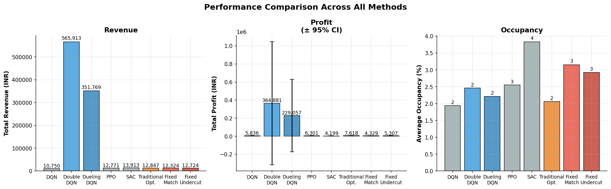

# Hotel Dynamic Pricing with Reinforcement Learning

Reinforcement learning agents (DQN, Double DQN, Dueling DQN, PPO, SAC) trained to
optimize hotel room pricing against real booking data. Benchmarked against traditional
optimizers with statistical significance testing and robustness analysis.

---
### Results



| Method | Mean Profit (INR) | 95% CI | Mean Revenue (INR) | vs Oracle |
|---|---|---|---|---|
| Traditional Opt. *(oracle)* | 7,667 | 5,589 – 9,744 | 12,570 | baseline |
| PPO | 6,818 | 5,560 – 8,077 | 12,098 | -11.1% |
| DQN | 5,794 | 4,529 – 7,058 | 10,814 | -24.4% |
| Fixed Undercut | 5,307 | 2,589 – 8,025 | 12,725 | -30.8% |
| SAC | 4,199 | 1,603 – 6,795 | 13,913 | -45.2% |
| Fixed Match | 4,329 | 2,078 – 6,581 | 12,324 | -43.5% |

> Double DQN and Dueling DQN results excluded — exploding profit values indicate
> a training instability bug (likely a missing reward normalization or target network
> update issue). Fix in progress.

**PPO comes closest to the oracle**, reaching 88.9% of oracle profit while generating
comparable revenue — suggesting it learns a near-optimal pricing policy without
access to the demand model the oracle uses.

**SAC achieves the highest revenue (13,913 INR) but lowest profit**, indicating it
learns an occupancy-maximizing policy (avg. 3.83 occupancy) at the cost of underpricing.
This is consistent with SAC's entropy regularization encouraging aggressive exploration
of the action space.
---

## What this project does

Standard DQN implementations for pricing tasks suffer from reward shaping that
leaks the answer — hand-tuned bonuses that encode occupancy targets directly into
the signal. This repo trains on **raw profit only**, then evaluates fairly:

| Dimension | Typical baseline | This project |
|---|---|---|
| Reward | 6 hand-tuned bonuses | Raw profit only |
| Algorithms | DQN only | DQN + Double DQN + Dueling DQN + PPO + SAC |
| State features | 5D | 5D and 8D |
| Statistics | None | Wilcoxon signed-rank + 95% CI |
| Robustness | 2 elasticity values | 5 elasticity values (ε ∈ {-0.5 … -1.2}) |

---

## Dataset

119,210 rows × 13 columns of hotel booking data.

**5D state:** `demand_index`, `occupancy`, `holiday_flag`, `day_of_week`, `competitor_price`

**8D state:** above + `lead_time`, `days_until_event`, `customer_rating`

The 8D experiment uses features already present in the data that prior work ignored.

## Project Structure

```
Dynamic-Pricing/
├── src/
│   ├── envs/
│   │   └── hotel_env.py          # Gymnasium environment (5D + 8D state variants)
│   ├── agents/
│   │   └── baselines.py          # TraditionalOptimizer, FixedMatch, FixedUndercut
│   └── evaluation/
│       ├── evaluator.py          # Shared evaluation engine
│       ├── stats.py              # Wilcoxon signed-rank tests, 95% CI, robustness table
│       └── plots.py              # Learning curves, heatmaps, comparison figures
├── data/
│   └── enhanced_data_fixed.csv   # 119,210 rows × 13 columns of hotel booking data
├── results/                      # Generated figures and CSV summaries (after evaluate.py)
├── models/                       # Saved model checkpoints (after train.py)
├── logs/                         # TensorBoard training logs
├── train.py                      # Train all algorithm variants
├── evaluate.py                   # Evaluate models and generate figures
└── requirements.txt
```
## Setup

```bash
pip install -r requirements.txt
```

---

## Usage

```bash
# Train all 5 algorithms (DQN variants + PPO + SAC)
python train.py --data data/enhanced_data_fixed.csv

# DQN variants only
python train.py --data data/enhanced_data_fixed.csv --dqn_only

# Also run 8D state experiment and reward ablation
python train.py --data data/enhanced_data_fixed.csv --ablation --experiment_8d

# Evaluate and generate all figures
python evaluate.py --data data/enhanced_data_fixed.csv --episodes 20 --robustness

# Monitor training
tensorboard --logdir logs/
```

---

## Experiments

1. **Algorithm comparison** — DQN vs Double DQN vs Dueling DQN vs PPO vs SAC vs baselines
2. **8D state experiment** — expanded state with lead time, event proximity, customer rating
3. **Reward ablation** — raw profit vs occupancy-capped reward
4. **Robustness sweep** — all agents evaluated across 5 demand elasticity values
5. **Statistical tests** — Wilcoxon signed-rank, 95% CI on all pairwise comparisons
